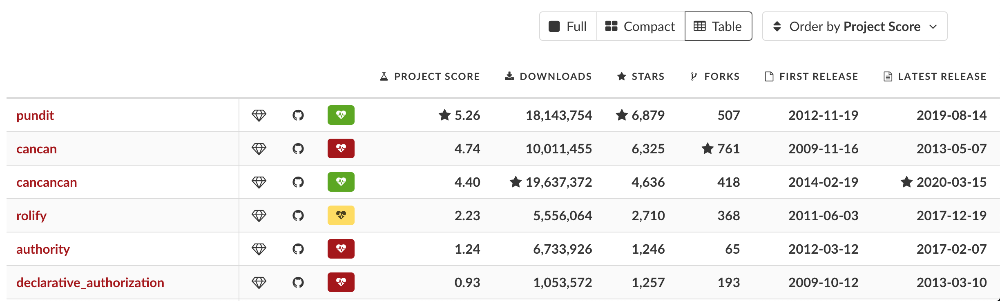

# Research

## The Task

Research and prepare brief notes on various tools and frameworks available for 
the Rails ecosystem that enable us to build role-based authorization.

## Judging Criteria

1. How well the tools integrate with ActiveRecord
2. How well the tools integrate with other parts of Rails + related libraries 
like Knock

## Other Considerations

### Role Management

User management is broken down into role management and authorization 
management. The identification of a user is a separate task we still need to 
handle. 

Example NewCo internal/external users
  - customer
  - customer support
  - finance admin
  - super admin
  - compliance

Role management definitely ties into an implementation of authorization, however
it's a separate piece which the evaluated tools below do not handle.

## Proof of Concept

### Baseline App -- Marketplace

The Marketplace is a platform to buy and sell goods. It includes the following 
actors and use cases:
- A Customer finds products from vendors
- A Vendor has many products for sale

Part of the Marketplace team
- A Customer Support agent who responds to feedback from users
- A Finance Admin tracks sales metrics
- A Compliance officer who gives vendors the boot if they don't meet sales 
targets
- A Super Admin assigns roles and can do all of the above

## Evaluated Tools

- [CanCanCan](https://github.com/CanCanCommunity/cancancan)
- [Pundit](https://github.com/varvet/pundit)
- ...but wait, there's (no) more? Not really:

### CanCanCan

- Modernized version created in 2019 from CanCan (created in 2009)
- DSL
- Housed in one Ability class

My Findings
- Slogged through documentation and reluctant to begin implementation
- Approach feels ActiveAdmin-like and one we wouldn't ourselves do

### Pundit

- Fresh implementation created in 2012
- Define and enforce policies for your resources using simple Ruby objects -- PORC
- Organized in individual classes

My Findings:

- Enjoyed reading documentation and eager to begin implementation
- Approach feels more natural and one we might've done ourself